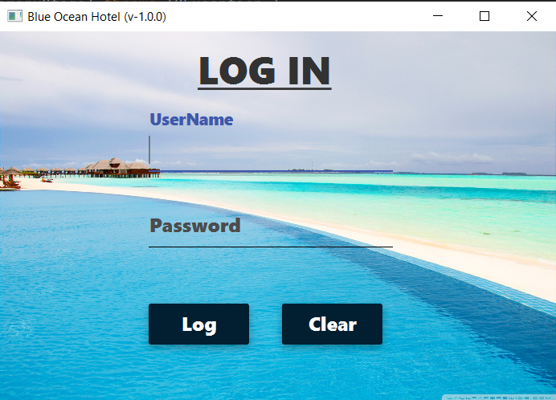
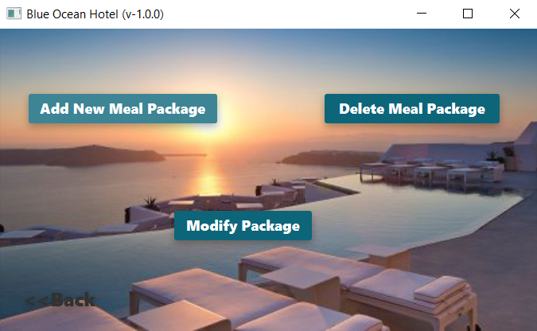
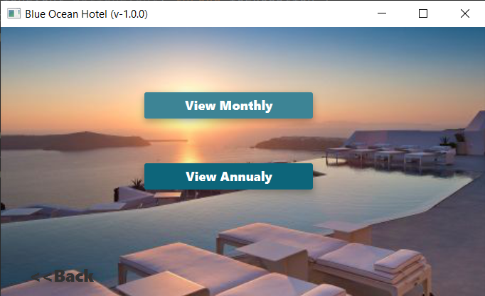

# Blue Ocean Hotel 

This is the second project of first semester done by using JavaFx

*MVC Architecture 
*Java 
*UI make using javaFx

#DashBoard 
 
#signUp 
 
#login 
 
 
#admin 
 
 
 
 
#room 
 
 
 
#meal 
 
 
 
