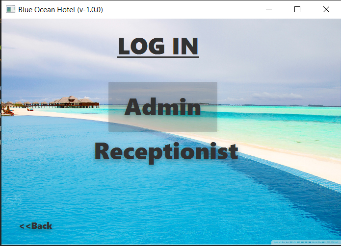
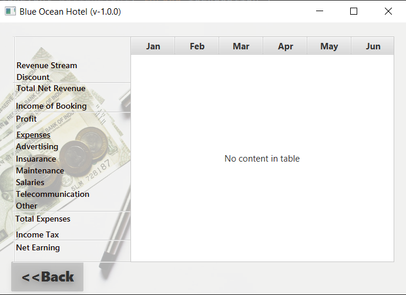
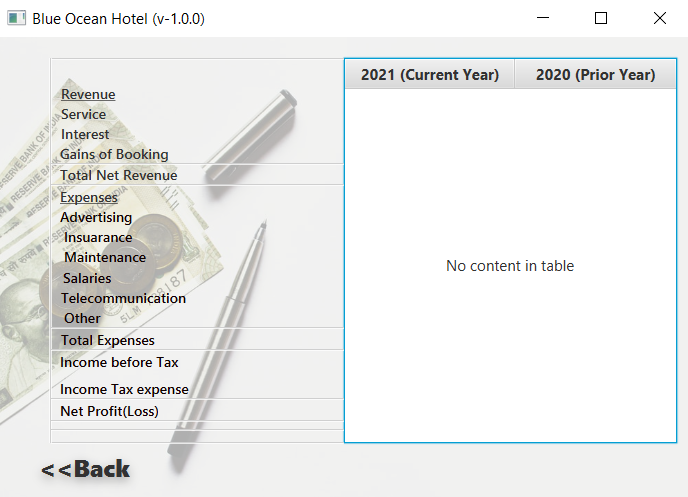
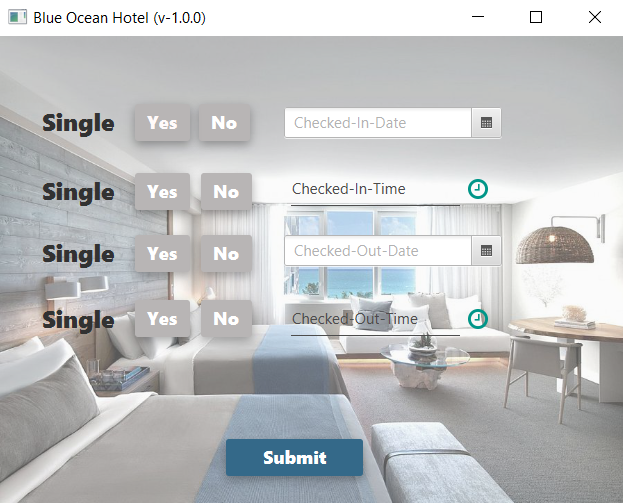

# Blue Ocean Hotel 

This is the second project of first semester done by using JavaFx

*MVC Architecture 
*Java 
*UI make using javaFx

#DashBoard 
 
#SignUp 
 
#Login 
 
 
#Admin 
 
 
 
 
#Room 
 
 
 
#Meal 
 
 
 
#Income 
 
 
#Reception 
 
 
 
 
 
 

